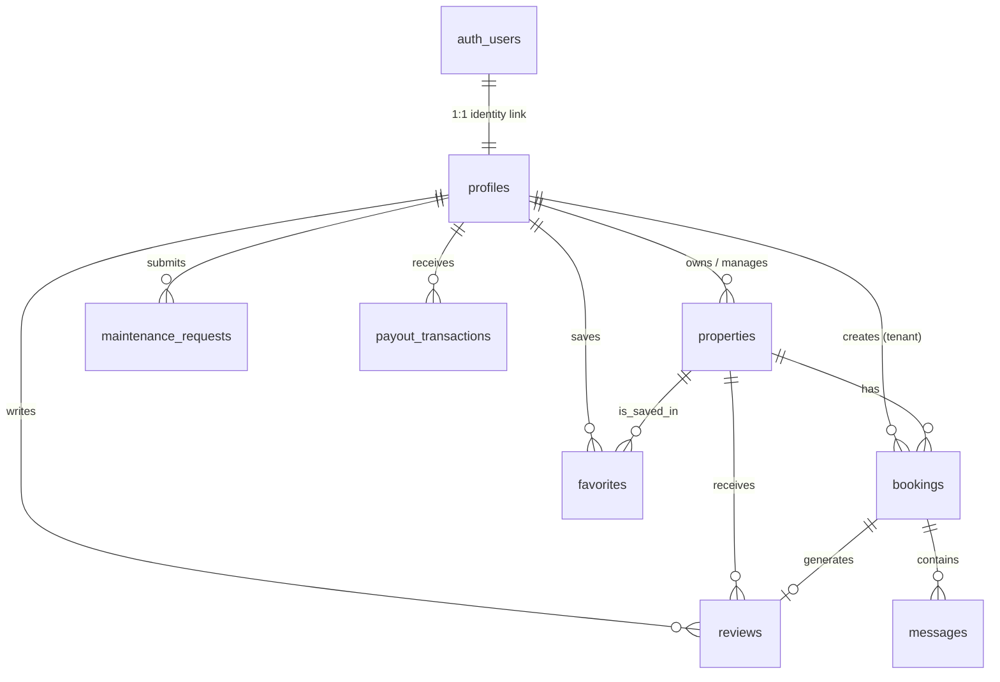

# Rentora RealEstate — Supabase Database ERD & Data Architecture Documentation

This document provides a comprehensive Entity-Relationship Diagram (ERD), full schema mapping, data dictionary, and Row Level Security (RLS) matrix for the **Rentora RealEstate Marketplace** migration to **Supabase PostgreSQL**.

---

## 1. High-Level System Architecture

```
                                  +---------------------------------------+
                                  |         Rentora Frontend (React)      |
                                  +---------------------------------------+
                                                      |
                                          Supabase Client SDK & REST
                                                      |
                                                      v
      +-----------------------------------------------------------------------------------------------+
      |                                   Supabase Platform Cloud                                    |
      |                                                                                               |
      |  +---------------------+   +---------------------+   +------------------+  +---------------+  |
      |  |   Supabase Auth     |   | Supabase Postgres   |   | Supabase Storage |  | Realtime WS   |  |
      |  | (auth.users & JWTs) |   | (public.* Schemas)  |   | (S3 Buckets)     |  | Subscriptions |  |
      |  +---------------------+   +---------------------+   +------------------+  +---------------+  |
      +-----------------------------------------------------------------------------------------------+
```

---

## 2. Mermaid Entity-Relationship Diagram (ERD)



---

## 3. Detailed Data Dictionary & Field Mapping

### A. `public.profiles`
*Extends Supabase `auth.users` with user profile details, roles, and landlord verification stats.*

| Rentora Field (`User`) | Supabase Column | Data Type | Nullable | Description / Constraint |
| :--- | :--- | :--- | :--- | :--- |
| `id` | `id` | `UUID` | **NO** | Foreign key to `auth.users(id) ON DELETE CASCADE` |
| `email` | `email` | `TEXT` | **NO** | Unique user email address |
| `name` | `full_name` | `TEXT` | **NO** | User's full display name |
| `phone` | `phone` | `TEXT` | YES | Contact phone number |
| `role` | `role` | `TEXT` | **NO** | `'tenant'`, `'landlord'`, `'agent'`, or `'admin'` |
| `avatarUrl` | `avatar_url` | `TEXT` | YES | Storage URL or gravatar link |
| `company` | `company` | `TEXT` | YES | Agency or business company name |
| `licenseNumber` | `license_number` | `TEXT` | YES | Real estate agent verification license |
| `bio` | `bio` | `TEXT` | YES | Agent or landlord biography statement |
| `isVerified` | `is_verified` | `BOOLEAN` | **NO** | Default `false` |
| - | `created_at` | `TIMESTAMPTZ` | **NO** | Default `NOW()` |
| - | `updated_at` | `TIMESTAMPTZ` | **NO** | Default `NOW()` |

---

### B. `public.properties`
*Main listings table supporting multi-currency pricing, geo-coordinates, green energy metrics, and rich media.*

| Rentora Field (`Listing`) | Supabase Column | Data Type | Nullable | Description / Constraint |
| :--- | :--- | :--- | :--- | :--- |
| `id` | `id` | `UUID` | **NO** | Primary Key (`uuid_generate_v4()`) |
| `landlordId` | `landlord_id` | `UUID` | YES | Foreign Key to `profiles(id) ON DELETE SET NULL` |
| `landlordName` | `landlord_name` | `TEXT` | **NO** | Owner or agent display name |
| `contactRole` | `contact_role` | `TEXT` | YES | `'landlord'` or `'agent'` |
| `agentCompany` | `agent_company` | `TEXT` | YES | Managed agency name |
| `agentLicense` | `agent_license` | `TEXT` | YES | Official agent credential number |
| `contactPhone` | `contact_phone` | `TEXT` | YES | Direct contact phone |
| `contactEmail` | `contact_email` | `TEXT` | YES | Direct contact email |
| `title` | `title` | `TEXT` | **NO** | Property title |
| `description` | `description` | `TEXT` | **NO** | Full property text description |
| `price` | `price` | `NUMERIC(12,2)` | **NO** | Listing price in USD |
| `pricePeriod` | `price_period` | `TEXT` | YES | `'annual'`, `'monthly'`, or `'daily'` |
| `localPrice` | `local_price` | `NUMERIC(12,2)` | YES | Price in regional currency (e.g. NGN, EUR) |
| `currency` | `currency` | `TEXT` | YES | Default `'NGN'` |
| `type` | `type` | `TEXT` | **NO** | Property category (`Apartment`, `Villa`, etc.) |
| `location` | `location` | `TEXT` | **NO** | Human readable address string |
| `lat` | `lat` | `NUMERIC(10,7)`| **NO** | Latitude geo-coordinate |
| `lng` | `lng` | `NUMERIC(10,7)`| **NO** | Longitude geo-coordinate |
| `bedrooms` | `bedrooms` | `INT` | YES | Bedroom count |
| `bathrooms` | `bathrooms` | `INT` | YES | Bathroom count |
| `size` | `size` | `NUMERIC(8,2)` | YES | Size in sqft / sqm |
| `amenities` | `amenities` | `JSONB` | YES | Array of strings (`["Pool", "WiFi"]`) |
| `images` | `images` | `JSONB` | YES | Array of image URLs/paths |
| `videoUrl` | `video_url` | `TEXT` | YES | Virtual tour video link |
| `status` | `status` | `TEXT` | **NO** | `'active'`, `'pending'`, `'rented'`, `'inactive'` |
| `isVerified` | `is_verified` | `BOOLEAN` | YES | Verified listing badge flag |
| `energyRating` | `energy_rating` | `TEXT` | YES | Energy efficiency grade (e.g. `A+`, `B`) |
| `solarPowered` | `solar_powered` | `BOOLEAN` | YES | Green energy feature flag |
| - | `created_at` | `TIMESTAMPTZ` | **NO** | Default `NOW()` |

---

### C. `public.bookings`
*Handles tenant viewing requests, lease applications, and payment confirmations.*

| Rentora Field (`Booking`) | Supabase Column | Data Type | Nullable | Description / Constraint |
| :--- | :--- | :--- | :--- | :--- |
| `id` | `id` | `UUID` | **NO** | Primary Key |
| `listingId` | `listing_id` | `UUID` | **NO** | Foreign Key to `properties(id) ON DELETE CASCADE` |
| `listingTitle` | `listing_title` | `TEXT` | **NO** | Title snippet for quick rendering |
| `userId` | `user_id` | `UUID` | YES | Foreign Key to `profiles(id) ON DELETE SET NULL` |
| `guestName` | `user_name` | `TEXT` | **NO** | Tenant name |
| `guestEmail` | `user_email` | `TEXT` | **NO** | Tenant email |
| `startDate` | `preferred_date` | `TIMESTAMPTZ` | **NO** | Target move-in or tour date |
| `preferredTime` | `preferred_time` | `TEXT` | YES | Scheduled time slot |
| `status` | `status` | `TEXT` | **NO** | `'pending'`, `'approved'`, `'rejected'`, `'confirmed'` |
| `totalAmount` | `total_amount` | `NUMERIC(12,2)`| YES | Total lease or deposit cost |
| - | `created_at` | `TIMESTAMPTZ` | **NO** | Default `NOW()` |

---

### D. `public.reviews`
*Ratings and testimonials submitted by verified tenants.*

| Rentora Field (`PropertyReview`) | Supabase Column | Data Type | Nullable | Description / Constraint |
| :--- | :--- | :--- | :--- | :--- |
| `id` | `id` | `UUID` | **NO** | Primary Key |
| `listingId` | `listing_id` | `UUID` | **NO** | Foreign Key to `properties(id) ON DELETE CASCADE` |
| `bookingId` | `booking_id` | `UUID` | YES | Unique Foreign Key to `bookings(id)` |
| `guestId` | `guest_id` | `UUID` | YES | Foreign Key to `profiles(id)` |
| `guestName` | `guest_name` | `TEXT` | **NO** | Reviewer display name |
| `rating` | `rating` | `INT` | **NO** | Score between 1 and 5 |
| `comment` | `comment` | `TEXT` | **NO** | Written review text |
| `createdAt` | `created_at` | `TIMESTAMPTZ` | **NO** | Default `NOW()` |

---

### E. `public.favorites`
*Saved properties per tenant account.*

| Column Name | Data Type | Nullable | Constraint |
| :--- | :--- | :--- | :--- |
| `id` | `UUID` | **NO** | Primary Key |
| `user_id` | `UUID` | **NO** | Foreign Key to `profiles(id) ON DELETE CASCADE` |
| `listing_id` | `UUID` | **NO** | Foreign Key to `properties(id) ON DELETE CASCADE` |
| `created_at` | `TIMESTAMPTZ` | **NO** | Default `NOW()` |
| **Constraint** | `UNIQUE(user_id, listing_id)` | - | Prevents duplicate saves |

---

### F. `public.maintenance_requests`
*Service and repair tickets reported by tenants.*

| Column Name | Data Type | Nullable | Description |
| :--- | :--- | :--- | :--- |
| `id` | `UUID` | **NO** | Primary Key |
| `ticket_code` | `TEXT` | **NO** | Unique ticket identifier (e.g. `TICK-94210`) |
| `listing_title` | `TEXT` | **NO** | Property name |
| `tenant_uid` | `UUID` | YES | Foreign Key to `profiles(id)` |
| `tenant_name` | `TEXT` | **NO** | Tenant display name |
| `tenant_email` | `TEXT` | **NO** | Tenant contact email |
| `issue_title` | `TEXT` | **NO** | Short issue title |
| `description` | `TEXT` | **NO** | Complete maintenance issue description |
| `status` | `TEXT` | **NO** | `'Pending Review'`, `'In Progress'`, `'Scheduled'`, `'Resolved'` |
| `landlord_note` | `TEXT` | YES | Technician notes or landlord response |
| `created_at` | `TIMESTAMPTZ` | **NO** | Default `NOW()` |

---

## 4. Row Level Security (RLS) Policy Summary

| Table | Operations | RLS Rule Description |
| :--- | :--- | :--- |
| **`profiles`** | `SELECT` | Publicly readable for property attribution. |
| | `INSERT/UPDATE` | Restricted to `auth.uid() = id`. Users can only edit their own profile. |
| **`properties`** | `SELECT` | Publicly readable by all site visitors. |
| | `INSERT/UPDATE/DELETE` | Restricted to authenticated landlords/agents (`auth.uid() = landlord_id`). |
| **`bookings`** | `SELECT/UPDATE` | Restricted to involved tenant (`user_id = auth.uid()`) or listing owner. |
| **`favorites`** | `ALL` | Strictly restricted to the owner (`user_id = auth.uid()`). |
| **`maintenance_requests`** | `SELECT/INSERT` | Authenticated tenants & landlords associated with the property. |

---

## 5. Storage Buckets Configuration

1. **`property-images`** (Public)
   - Usage: Storing uploaded high-res property gallery photos.
   - Access: Read is public; Write requires `auth.role() = 'authenticated'`.
2. **`avatars`** (Public)
   - Usage: User profile avatars and agency logos.
   - Access: Read is public; Write requires `auth.uid() = owner_id`.
3. **`property-documents`** (Private)
   - Usage: Lease agreements, proof of ownership, and identity docs.
   - Access: Restricted to property owner and assigned tenant.

---

## 6. Migration Status & Readiness

- [x] Initial SQL DDL schema created (`/supabase/migrations/001_initial_schema.sql`)
- [x] Dual-storage database abstraction layer created (`/src/services/databaseService.ts`)
- [x] Real-time Supabase Table Subscriptions enabled (`subscribeToSupabaseChanges`)
- [x] Maintenance Ticket creation synced with Supabase & In-App Notification Bell
- [x] Zero-breaking-change fallback store active for offline/preview environments
